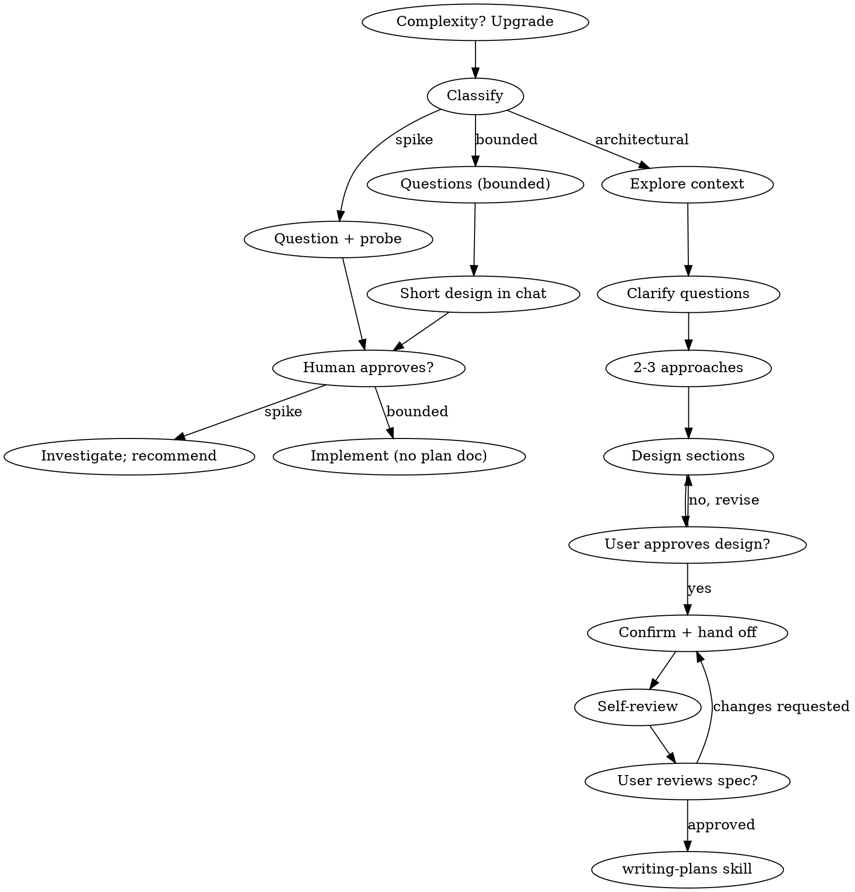

# Brainstorming Ideas Into Designs

Turn ideas into designs and specs through dialogue: classify process weight, understand context, refine the idea, present the design, get approval.

<HARD-GATE>
Do NOT invoke any implementation skill, write code, scaffold, or take
implementation action until you have told your human partner your
intent and they have approved it. Applies to EVERY task on EVERY path
below - the ceremony scales with the task; the approval gate never does.
</HARD-GATE>

## Three Paths

Classify before your first question; announce it so your human partner can override: "this looks bounded, so I'll present a short design here rather than write a spec".

- **Spike** - feasibility question ("can we...", "quick and dirty is fine"). Output = answer, not kept code. Present question + probe plan (2-3 sentences); on a nod, investigate as cheaply as correctness allows. No design doc, no spec file. Report a recommendation; label anything built throwaway.
- **Bounded** - change to code already in this repo: new flag, small endpoint, one-file fix. Bounded measures the repo, not familiarity: the flow you change must be here to read; no flow → not bounded. Ask the questions that matter; present a short design IN CHAT; STOP. Implement only after an explicit yes - bounded approval is as hard a gate as architectural. No spec file, no plan document.
- **Architectural** - new projects, new subsystems, restructured component fit, altered interfaces others depend on. Full process: questions, approaches, sectioned design, spec via technical-writer, then writing-plans.

Doubt → take the heavier path. Ratchet one-way: hidden complexity upgrades mid-task - stop, say so, step up. Nothing downgrades mid-task.

## Anti-Pattern: "Too Simple To Need Approval"

Every path ends with partner approval before implementation. A todo or config design may be two sentences - present it and get approval. "Simple" tasks hide unexamined assumptions; the artifact scales with simplicity, never the approval.

## Red Flags

| Thought | Reality |
|---------|---------|
| "This is too simple to need a design" | Simple = short design, not no design. Two sentences, then approval. |
| "I'll call it bounded and skip the spec" | Label-reaching to skip work IS the doubt. Heavier path. |
| "It's bounded and obvious - I'll start while they read" | The gate is approval. Present, stop, wait for yes. |
| "I understand this kind of app, so it's bounded" | Bounded measures the repo, not familiarity. New project = no flow = architectural. |
| "The spike works, so I'll keep the code" | Spike output = answer. Keeping code = new request; classify it. |
| "It grew, but I'm almost done - no re-classify" | Hidden complexity upgrades the path mid-task. Stop, say so. |
| "They approved the spike, so the follow-up is approved" | Each task gets its own classification and approval. |

## Checklist

Classify first; announce the path; one task per item; complete in order.

**Spike:**
1. **Explore project context** - enough to frame the probe
2. **Present question + probe plan** - 2-3 sentences
3. **Get approval** - a nod is enough
4. **Investigate** - as cheaply as correctness allows
5. **Report findings** - recommendation; label throwaway

**Bounded:**
1. **Explore project context** - files, docs, recent commits
2. **Ask clarifying questions** - one at a time, the ones that matter
3. **Present short design in chat** - approach, files touched, testing
4. **Get approval** - STOP; wait for explicit yes; presenting + starting skips the gate
5. **Implement** - normal workflow (TDD applies); no plan document

**Architectural:**
1. **Explore project context** — check files, docs, recent commits
2. **Ask clarifying questions** — one at a time, understand purpose/constraints/success criteria
3. **Propose 2-3 approaches** — with trade-offs and your recommendation
4. **Present design** — in sections scaled to their complexity, get user approval after each section
5. **Confirm design decisions with the user** — brainstorming ends here; brainstorming does not author the spec
6. **Hand off to `technical-writer`** — writes the spec at `docs/specs/YYYY-MM-DD-<topic>-design.md`
7. **Spec self-review** — quick inline check for placeholders, contradictions, ambiguity, scope (fix inline)
8. **User reviews written spec** — ask the user to review the spec at its path before proceeding
9. **Transition to implementation** — `writing-plans` skill

## Process Flow

**Terminal states are path-bound.** Architectural: hand the spec to technical-writer, then the ONLY next step is the writing-plans skill. Bounded: after approval, implement through the normal workflow; no plan document. Spike: report a recommendation.

## The Process

Bounded + architectural; spike stops at "present probe, get nod". **Exploring approaches** onward = architectural depth.

**Understanding the idea:**

- Scope check before detail: multiple independent subsystems → flag, decompose; each sub-project gets spec → plan → cycle.
- One question per message; multiple choice preferred.
- Focus: purpose, constraints, success criteria.

**Exploring approaches:**

- 2-3 approaches, trade-offs, recommendation first. YAGNI: cut unnecessary features.

**Presenting the design:**

- Scale to complexity: sentences simple; up to 200-300 words nuanced. Ask after each section.
- Cover architecture, components, data flow, error handling, testing; clarify when unclear.

**Design for isolation and clarity:**

- Units: one purpose, well-defined interfaces, understandable + testable alone (what it does, how to use it, what it depends on). Consumers never need internals; internals change without breaking consumers; else boundaries need work.

**Working in existing codebases:**

- Follow existing patterns; fix only what affects the work; no unrelated refactoring.

## After the Design (architectural path)

**Documentation:**

- `technical-writer` writes the validated design (spec) to `docs/specs/YYYY-MM-DD-<topic>-design.md` and commits it
  - (User preferences for spec location override this default)

**Spec Self-Review:**
Fresh eyes on the spec:

1. **Placeholder scan:** Any "TBD", "TODO", incomplete or vague items? Fix them.
2. **Internal consistency:** Sections contradict each other? Architecture vs feature descriptions?
3. **Scope check:** Focused enough for one plan, or needs decomposition?
4. **Ambiguity check:** Could a requirement be read two ways? Pick one; make it explicit.

Fix inline; no re-review.

**User Review Gate:**
After self-review, ask the user to review the written spec before proceeding:

> "Spec written and committed to `<path>`. Please review it and let me know if you want to make any changes before we start writing out the implementation plan."

Wait for the response; on change requests, fix and re-run the loop. Proceed only on approval.

## Implementation

- Invoke the `writing-plans` skill to create the implementation plan (technical-writer).
- Do NOT invoke any other skill. writing-plans is the next step.

## Compact Doc Style (committed specs/plans)

Caveman ultra compression + Simplified Technical English guardrails.

- Fragments OK. Tables and lists over prose. Drop filler.
- NEVER alter or drop: file paths, commands, code, numbers, negations, acceptance criteria, verification commands.
- Code blocks unchanged. Clarity wins over compression.
