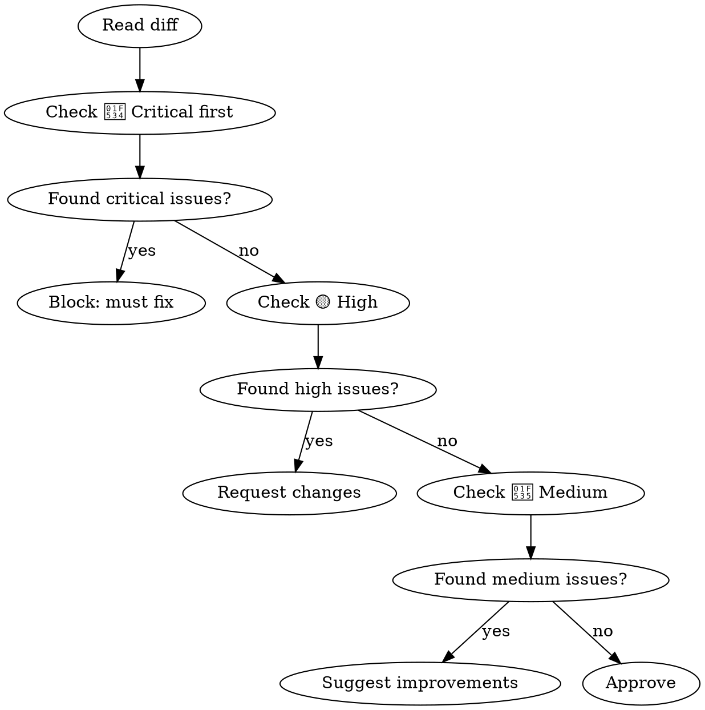

# Go Code Review — 100 Mistakes

Complete reference for reviewing Go code against all 100 mistakes from "100 Go Mistakes and How to Avoid Them" by Teiva Harsanyi. [100go.co](https://100go.co/)

## 1. Code and Project Organization (#1–16)

| # | Mistake | What to look for | Severity |
|---|---------|------------------|----------|
| 1 | Variable shadowing | `err :=` inside `if`/`for` blocks shadowing outer `err` | 🔴 |
| 2 | Nested code | Deeply nested `if`/`else` — should early return, keep happy path left | 🔵 |
| 3 | Misusing init functions | `init()` for setup that should be explicit functions | 🟡 |
| 4 | Overusing getters/setters | Forcing Java-style accessors on every struct field | 🔵 |
| 5 | Interface pollution | Interfaces defined before concrete need exists | 🟡 |
| 6 | Interface on producer side | Package forces abstraction on consumers | 🟡 |
| 7 | Returning interfaces | Functions returning `io.Reader` instead of concrete type | 🟡 |
| 8 | `any` says nothing | `func Foo(x any)` without type constraint | 🟡 |
| 9 | Confusing generics usage | Using type params when concrete types suffice | 🔵 |
| 10 | Type embedding problems | Embedded type promotes fields/methods that should be hidden | 🔵 |
| 11 | Not using functional options | Constructor takes 5+ positional params instead of `WithX()` | 🔵 |
| 12 | Project misorganization | Inconsistent structure, premature packaging, huge packages | 🔵 |
| 13 | Utility packages | `common/`, `util/`, `shared/` — rename to meaningful names | 🔵 |
| 14 | Package name collisions | Variable name shadows package name | 🔵 |
| 15 | Missing documentation | Exported functions/types without doc comments | 🔵 |
| 16 | Not using linters | No `golangci-lint`, `go vet`, or `errcheck` in CI | 🟡 |

## 2. Data Types (#17–29)

| # | Mistake | What to look for | Severity |
|---|---------|------------------|----------|
| 17 | Octal confusion | `010` is octal (8), not ten — use `0o10` | 🔵 |
| 18 | Integer overflows | Silent overflow at runtime, no panic — check bounds | 🟡 |
| 19 | Floating-point issues | Direct `==` comparison, grouping dissimilar magnitudes | 🔵 |
| 20 | Slice length vs capacity | `len(s)` vs `cap(s)` confusion | 🔵 |
| 21 | Inefficient slice init | `make([]int, 0, 100)` when `make([]int, 100)` is intended | 🔵 |
| 22 | Nil vs empty slice | `var s []int` vs `s := []int{}` — inconsistent handling | 🟡 |
| 23 | Checking slice emptiness | Using `len(s) == 0` instead of `s == nil` when nil-specific | 🔵 |
| 24 | Slice copy mistakes | `b := a` copies header, not data — use `copy()` or `append` | 🟡 |
| 25 | Slice append side effects | `append` on shared backing array mutates original | 🔴 |
| 26 | Slice memory leaks | Subslice retaining large backing array capacity | 🔴 |
| 27 | Inefficient map init | `make(map[string]int)` without size hint when known | 🔵 |
| 28 | Map memory leaks | Growing maps without reassigning — old keys leak | 🔴 |
| 29 | Comparing values incorrectly | Comparing structs/slices/funcs with `==` | 🟡 |

## 3. Control Structures (#30–35)

| # | Mistake | What to look for | Severity |
|---|---------|------------------|----------|
| 30 | Range loop copy | Modifying `v` in `for _, v := range` doesn't affect original | 🟡 |
| 31 | Range arg evaluation | Channel/array args evaluated once before loop, not each iter | 🔵 |
| 32 | Pointer elements in range | Pointer in range var shares address across iterations | 🟡 |
| 33 | Map iteration assumptions | Assuming map order is deterministic, inserting during iter | 🔵 |
| 34 | Break in select | `break` only exits `select`, not enclosing `for` | 🔵 |
| 35 | Defer in loop | `defer f.Close()` inside loop — all deferred until func return | 🟡 |

## 4. Strings (#36–41)

| # | Mistake | What to look for | Severity |
|---|---------|------------------|----------|
| 36 | Rune concept | Iterating string with `range` gives runes, not bytes | 🔵 |
| 37 | Inaccurate string iteration | Using index on string for byte access — string is UTF-8 | 🔵 |
| 38 | Misusing trim functions | `TrimLeft`/`TrimRight` trim character sets, not substrings | 🔵 |
| 39 | Under-optimized concat | `s += "x"` in loop instead of `strings.Builder` | 🔵 |
| 40 | Useless string conversions | `string([]byte(s))` when `s` is already string | 🔵 |
| 41 | Substring memory leaks | Substring retains reference to original string's bytes | 🟡 |

## 5. Functions and Methods (#42–47)

| # | Mistake | What to look for | Severity |
|---|---------|------------------|----------|
| 42 | Receiver type confusion | Value receiver on large struct or pointer-receiver mutation | 🟡 |
| 43 | Never using named results | Long return lists without names for clarity | 🔵 |
| 44 | Named result side effects | Naked `return` with named results causes unintended values | 🟡 |
| 45 | Returning nil receiver | Interface wrapping nil concrete value returns non-nil interface | 🔴 |
| 46 | Filename as input | `func Read(path string)` instead of `func Read(r io.Reader)` | 🟡 |
| 47 | Defer argument evaluation | `defer fmt.Println(x)` captures `x` at call time, not return | 🔵 |

## 6. Error Management (#48–54)

| # | Mistake | What to look for | Severity |
|---|---------|------------------|----------|
| 48 | Panicking | `panic()` in library code instead of returning errors | 🟡 |
| 49 | Not wrapping errors | Missing `fmt.Errorf("context: %w", err)` | 🟡 |
| 50 | Error type comparison | Using type assertion instead of `errors.As` for wrapped errors | 🟡 |
| 51 | Error value comparison | `err == ErrFoo` fails with wrapped errors — use `errors.Is` | 🟡 |
| 52 | Handling error twice | Both returning and logging the same error | 🔵 |
| 53 | Not handling error | `val, _ := foo()` or unchecked `err` returns | 🔴 |
| 54 | Defer errors ignored | `defer f.Close()` without checking return value | 🟡 |

## 7. Concurrency: Foundations (#55–60)

| # | Mistake | What to look for | Severity |
|---|---------|------------------|----------|
| 55 | Concurrency ≠ parallelism | Using goroutines for CPU-bound work expecting speedup | 🔵 |
| 56 | Concurrency always faster | Adding goroutines to I/O that doesn't benefit from concurrency | 🔵 |
| 57 | Channels vs mutexes | Using channels for shared state, mutexes for signaling | 🟡 |
| 58 | Race problems | Data race (unsynchronized access) vs race condition (ordering) | 🔴 |
| 59 | Workload type impacts | Not considering if workload is CPU/IO/memory bound | 🔵 |
| 60 | Context misuse | Using context for values instead of cancellation/deadlines | 🟡 |

## 8. Concurrency: Practice (#61–74)

| # | Mistake | What to look for | Severity |
|---|---------|------------------|----------|
| 61 | Inappropriate context | Propagating wrong context (e.g., request ctx to background job) | 🟡 |
| 62 | Goroutine leaks | Goroutines without cancellation or done channel | 🔴 |
| 63 | Loop variable capture | `go func() { use(i) }` in loop (fixed in Go 1.22+) | 🔴 |
| 64 | Non-deterministic select | `select` with multiple ready channels picks randomly | 🔵 |
| 65 | Notification channels | Not using `chan struct{}` for signal-only channels | 🔵 |
| 66 | Nil channels | Not leveraging nil channels to disable select cases | 🔵 |
| 67 | Channel sizing | Unbuffered channel when sender shouldn't block | 🟡 |
| 68 | String formatting side effects | `fmt.Sprintf` in concurrent code can cause data races | 🟡 |
| 69 | Append data races | Concurrent `append` on shared slice without sync | 🔴 |
| 70 | Mutex with slices/maps | Protecting slice header but not underlying data | 🟡 |
| 71 | WaitGroup misuse | `wg.Add` inside goroutine instead of before launch | 🟡 |
| 72 | Forgetting sync.Cond | Not using `sync.Cond` for wait/notify patterns | 🔵 |
| 73 | Not using errgroup | Manual error + goroutine management instead of `errgroup` | 🔵 |
| 74 | Copying sync types | `sync.Mutex`, `sync.WaitGroup` passed by value | 🔴 |

## 9. Standard Library (#75–81)

| # | Mistake | What to look for | Severity |
|---|---------|------------------|----------|
| 75 | Wrong time duration | `time.Sleep(1000)` — missing `* time.Millisecond` | 🟡 |
| 76 | `time.After` in loops | Creates new timer each iteration, leaking until fire | 🟡 |
| 77 | JSON mistakes | Missing `omitempty`, wrong tags, ignoring decode errors | 🟡 |
| 78 | SQL mistakes | Not using parameterized queries, ignoring `rows.Err()` | 🟡 |
| 79 | Resource leaks | Unclosed `resp.Body`, `sql.Rows`, `os.File` | 🔴 |
| 80 | Missing return after Write | `http.Error()` then code continues executing | 🔴 |
| 81 | Default HTTP client | Using `http.DefaultClient`/`http.DefaultServeMux` without config | 🟡 |

## 10. Testing (#82–90)

| # | Mistake | What to look for | Severity |
|---|---------|------------------|----------|
| 82 | Test categorization | No build tags, short mode, or env var separation | 🟡 |
| 83 | Race flag missing | `go test` without `-race` | 🟡 |
| 84 | Test execution modes | Not using `-parallel` or `-shuffle` | 🔵 |
| 85 | Table-driven tests | Tests not using table-driven pattern for similar cases | 🔵 |
| 86 | Sleeping in tests | `time.Sleep` instead of channels/events for sync | 🟡 |
| 87 | Time API in tests | Not using `time.Now()` mockable interface | 🔵 |
| 88 | Testing utilities | Not using `httptest`, `iotest` packages | 🔵 |
| 89 | Inaccurate benchmarks | Not using `b.ResetTimer()`, not running足够 iterations | 🟡 |
| 90 | Testing features | Not using `t.Helper()`, `t.Cleanup()`, `testing.F` (fuzzing) | 🔵 |

## 11. Optimizations (#91–100)

| # | Mistake | What to look for | Severity |
|---|---------|------------------|----------|
| 91 | CPU caches | Not considering cache-friendly data access patterns | 🔵 |
| 92 | False sharing | Goroutines writing to same cache line from different cores | 🔵 |
| 93 | Instruction-level parallelism | Not considering CPU pipelining for instruction ordering | 🔵 |
| 94 | Data alignment | Struct field ordering causing unnecessary padding | 🔵 |
| 95 | Stack vs heap | Returning pointers that escape to heap unnecessarily | 🔵 |
| 96 | Reducing allocations | Not using `sync.Pool`, compiler hints, or API changes | 🔵 |
| 97 | Inlining | Functions too large for compiler inlining | 🔵 |
| 98 | Diagnostics tooling | Not using `pprof`, `trace`, `go tool trace` | 🟡 |
| 99 | GC behavior | Not understanding GC pauses, GOGC, memory pressure | 🟡 |
| 100 | Docker/K8s impacts | Not accounting for cgroups, container CPU/memory limits | 🟡 |

## Severity Legend

| Level | Meaning | Action |
|-------|---------|--------|
| 🔴 | **Critical** — Bug, data loss, security issue | Block: must fix before merge |
| 🟡 | **High** — Correctness risk, resource leak, poor practice | Request changes |
| 🔵 | **Medium** — Style, naming, micro-optimization | Suggest improvement |

## Review Flow



## Key Code Patterns

### Error Handling
```go
// BAD
val, _ := foo()
return err

// GOOD
val, err := foo()
if err != nil {
    return fmt.Errorf("foo: %w", err)
}
```

### Slice Gotchas
```go
// BAD: Shared backing array
b := a[:2]
b = append(b, 100)  // mutates a

// BAD: Leaking capacity
return items[:10]  // caller sees full backing array

// GOOD: Copy to decouple
result := make([]Item, 10)
copy(result, items)
```

### Concurrency
```go
// BAD: Goroutine leak
go func() {
    for msg := range ch { process(msg) }
}()

// GOOD: Context-aware
go func() {
    for {
        select {
        case <-ctx.Done(): return
        case msg := <-ch: process(msg)
        }
    }
}()

// BAD: Data race
go func() { count++ }()

// GOOD: Atomic
var count atomic.Int64
go func() { count.Add(1) }()
```

### Defer in Loop
```go
// BAD
for _, f := range files {
    defer f.Close()
}

// GOOD
for _, f := range files {
    func() {
        defer f.Close()
        process(f)
    }()
}
```

### Returning Nil Receiver
```go
// BAD: Returns non-nil interface wrapping nil concrete
var err *MyError = nil
return err  // interface is non-nil!

// GOOD: Return error interface directly
if err != nil {
    return err
}
return nil
```

## When NOT to Flag

- **Intentional shadowing** of `err` in short `if` blocks (idiomatic pattern)
- **Init functions** for package-level `var` initialization (acceptable)
- **Interfaces on producer** when API design genuinely requires it
- **Returning interfaces** when abstraction is stable and intentional
- **`any` type** in legitimate cases (serialization, logging, reflection)
- **Generics** when type parameter genuinely reduces boilerplate
- **Goroutines** for simple fire-and-forget tasks with no leak risk
- **`time.Sleep`** in tests when timing is the behavior under test

## Output Format

```
🔴 L42: Data race — concurrent map write without sync. Use sync.RWMutex.
🟡 L88: Goroutine leak — no cancellation path. Add ctx.Done() select.
🔵 L12: Missing doc comment on exported function `ProcessItems`.
```

## References

- [100go.co](https://100go.co/) — full mistake descriptions and source code
- [go.dev/doc](https://go.dev/doc/) — official Go documentation
- [Effective Go](https://go.dev/doc/effective_go) — Go coding guidelines
- [Go Code Review Comments](https://github.com/golang/go/wiki/CodeReviewComments) — review standards
